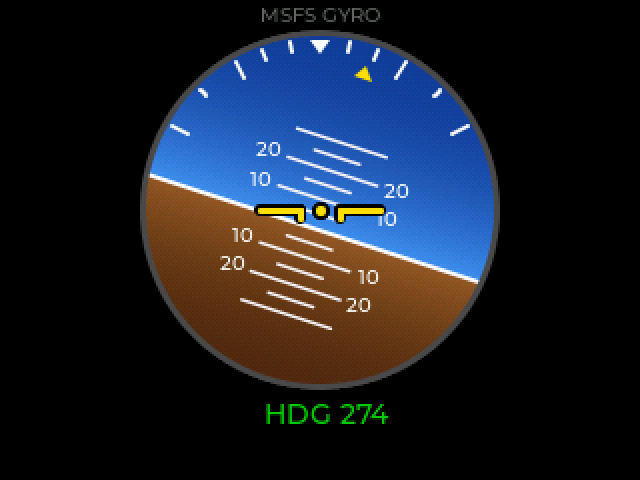
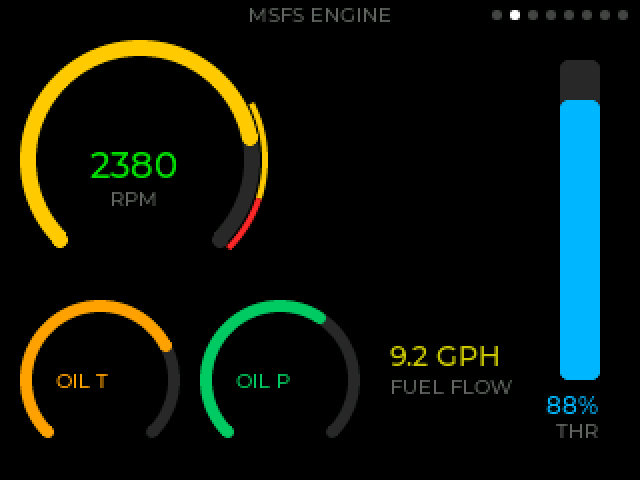
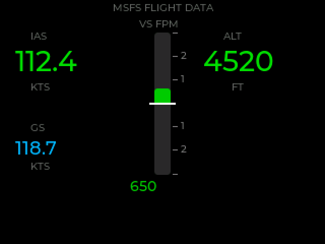
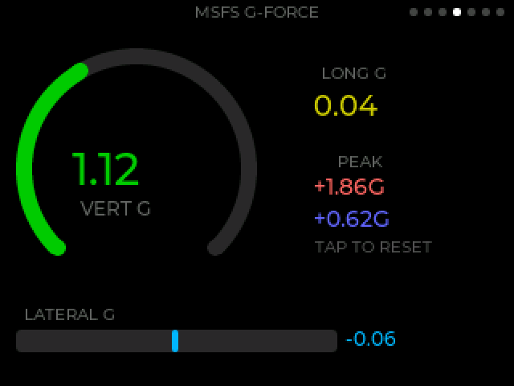
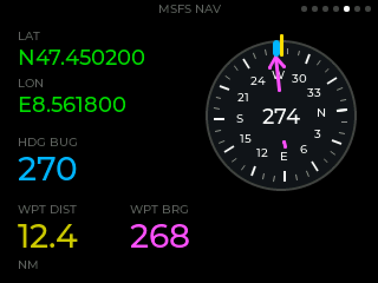
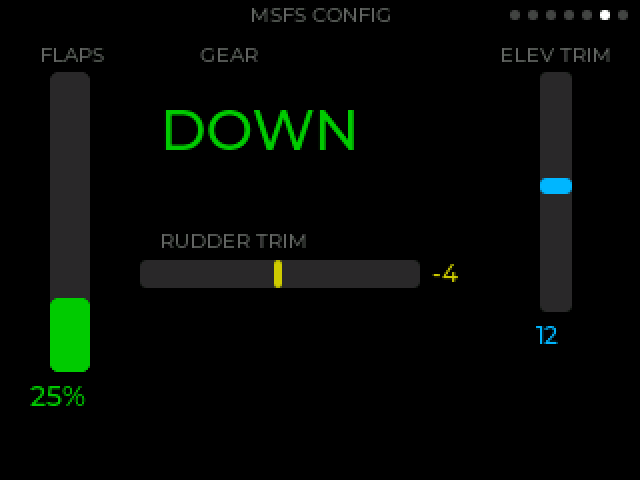
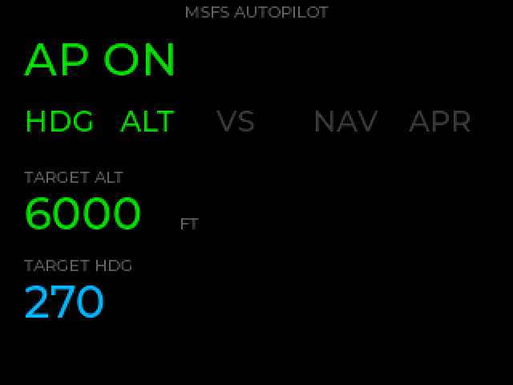
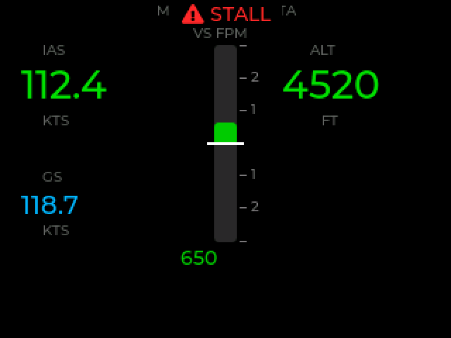

# MSFS 2024 HUD

A flight data HUD for the **ESP32-2432S024C** (Cheap Yellow Display), built with LVGL. A small Windows companion app reads telemetry from Microsoft Flight Simulator 2024 via SimConnect and streams it to the display as binary frames over USB serial or WiFi (UDP).

Tap the touchscreen to cycle through the 7 screens.

## Screens

<table>
  <tr>
    <td align="center"><br><b>Gyroscope</b><br>Artificial horizon, pitch ladder, heading</td>
    <td align="center"><br><b>Engine</b><br>RPM with caution/limit bands, throttle, oil, fuel flow</td>
    <td align="center"><br><b>Flight Data</b><br>Airspeed, altitude, vertical speed, ground speed</td>
  </tr>
  <tr>
    <td align="center"><br><b>G-Force</b><br>Vertical / lateral / longitudinal G, peaks</td>
    <td align="center"><br><b>Navigation</b><br>Compass card, heading bug, waypoint bearing pointer</td>
    <td align="center"><br><b>Config</b><br>Flaps, gear, elevator and rudder trim</td>
  </tr>
  <tr>
    <td align="center"><br><b>Autopilot</b><br>Lit mode annunciators, target altitude and heading</td>
    <td align="center"><br><b>Alerts</b><br>Blinking overlay on every screen, plus the red LED</td>
    <td></td>
  </tr>
</table>

<sub>The screenshots are rendered on a desktop from the real widget code at the panel's 320×240 resolution with sample telemetry (see [Development](#development)); they are not photos of the device.</sub>

Alerts (engine fire, stall, overspeed, gear unsafe) are shown by priority. The display shows `NO DATA` when nothing has arrived for 2 seconds.

## Hardware

- **Board**: ESP32-2432S024C (2.4" 320x240 ILI9341, capacitive touch)
- **Display**: ILI9341 on HSPI, backlight on GPIO 27
- **Touch**: CST816S on I2C (SDA=33, SCL=32, RST=25, INT=21)
- **Alert LED**: on-board red LED on GPIO 4

## Quick Start

### Windows installer (recommended)

Plug the display into the PC that runs MSFS 2024, then either double-click **`Install.cmd`** in a downloaded copy of this repository, or paste this into PowerShell:

```powershell
irm https://raw.githubusercontent.com/florianbaer/msfs24-cyd-hud/main/installer/bootstrap.ps1 | iex
```

The installer takes care of everything, without admin rights:

1. **Finds the display** on USB by its USB chip (CH340 / CH9102 / CP210x) and points you to the driver if Windows has none.
2. **USB or WiFi**: for WiFi it asks for the network and password; the password only ends up in the firmware, never in the repository folder.
3. **Builds and flashes the firmware** with a private Arduino toolchain under `%LOCALAPPDATA%\MsfsCydHud` — your own Arduino IDE setup and libraries are left alone. For WiFi it reads the display's IP address from its boot log.
4. **Builds the sender**: installs the .NET 10 SDK for your user if it is missing and finds the MSFS 2024 SDK (or explains how to install it from the simulator's developer menu).
5. **Tests the display** with a 15-second synthetic flight.
6. **Starts the HUD with MSFS** via `exe.xml` (Steam and Microsoft Store, with a backup of the file), and adds Start-menu shortcuts and an *Apps & features* entry for uninstalling.

Re-run it any time to re-flash, switch between USB and WiFi or update the sender — your previous answers are the defaults. `Install.cmd -Yes` accepts all defaults, `Install.cmd -Uninstall` removes everything again. A full log is written to `%LOCALAPPDATA%\MsfsCydHud\install.log`.

For USB the sender is registered with the target `auto`: it finds the display by its USB chip, so a different COM number after re-plugging does not break anything.

### Manual setup

#### 1. Flash the display

See [docs/SETUP.md](docs/SETUP.md) for Arduino IDE and PlatformIO instructions. With PlatformIO it is:

```sh
pio run -t upload
```

#### 2. Run the sender (Windows, next to MSFS 2024)

The sender needs the SimConnect libraries from the MSFS 2024 SDK, so it is built from source on a machine that has the SDK installed. See [docs/MSFS_PLUGIN.md](docs/MSFS_PLUGIN.md) for details.

```sh
set MSFS_SDK=C:\MSFS 2024 SDK
cd msfs-sender
dotnet run --project MsfsHudSender                      # USB, finds the display by itself
dotnet run --project MsfsHudSender -- COM6               # USB serial on a fixed port, 20 Hz
dotnet run --project MsfsHudSender -- COM6 --hz 30       # faster updates
dotnet run --project MsfsHudSender -- 192.168.1.50 --udp # WiFi
dotnet run --project MsfsHudSender -- --demo             # display test without MSFS
```

The sender waits until MSFS is running and exits when the simulator quits.

## Display quality

The ESP32 drives a 16-bit (RGB565) SPI panel, so the firmware works to make every frame count:

- **Anti-aliased attitude indicator.** The horizon ball is rasterised per pixel with sub-pixel coverage on the horizon, the pitch ladder and the bezel — no stair-stepping when the aircraft banks. Bank scale, roll pointer, pitch numbers and the aircraft symbol are drawn with LVGL's anti-aliased primitives on top.
- **Dithered gradients.** Sky and ground are lit gradients; a 4×4 ordered (Bayer) dither restores the in-between shades RGB565 cannot store, so there is no colour banding.
- **Smooth motion.** Telemetry arrives at 20–30 Hz; the gyro eases toward each new sample ([`Smoothing.h`](lib/hud_widgets/Smoothing.h)) and redraws at up to ~40 fps, so the horizon glides instead of stepping. Heading takes the short way round through north.
- **Gliding gauges on every screen.** Arcs and bars ease to each new value ([`Anim.h`](lib/hud_widgets/Anim.h)) instead of jumping, and the nav compass card turns smoothly with the aircraft heading.
- **More instrument, less text.** The engine RPM arc carries caution and limit bands, the vertical-speed bar has a scale and a zero mark, and the nav screen has a compass card with the heading bug and a bearing pointer to the next waypoint.
- **DMA double buffering.** LVGL renders into one buffer while the other streams to the panel over DMA, so drawing and the SPI transfer overlap (falls back to a single buffer if DMA memory is short). The serial log prints which mode is active.
- **Only what changed.** LVGL redraws dirty areas at up to 60 Hz; static screens cost nothing, and the gyro is not redrawn while another screen is shown.

The backlight is PWM-driven; lower `BACKLIGHT_BRIGHTNESS` in `ship_hud.ino` for night flying.

## Protocol

Binary frames at 115200 baud (or one frame per UDP datagram), COBS-framed with a CRC-8.

```
[0x00] [COBS-encoded: msg_type | payload... | CRC8] [0x00]
```

All multi-byte fields are little-endian.

| ID | Name | Payload |
|----|------|---------|
| `0x02` | Attitude | 6 bytes: pitch, roll, heading (i16, tenths of degrees; pitch + = nose up, roll + = left wing down) |
| `0x03` | Engine | 7 bytes: engine_idx(u8), rpm(u16), throttle %(u8), fuel_flow, oil_temp, oil_press (u8, scaled) |
| `0x04` | FlightData | 10 bytes: airspeed(u16, tenths kt), altitude(i32, ft), vspeed(i16, fpm), ground_speed(u16, tenths kt) |
| `0x05` | GForce | 6 bytes: longitudinal, vertical, lateral (i16, hundredths of G) |
| `0x06` | Alerts | 2 bytes: flags(u16) — bit 0 stall, 1 overspeed, 2 gear unsafe, 3 low fuel, 4 engine fire, 5 A/P disconnect |
| `0x07` | NavData | 14 bytes: lat, lon (i32, degrees × 1e7), hdg_bug(i16), wp_dist(u16, tenths NM), wp_bearing(i16) |
| `0x08` | Config | 4 bytes: flaps %(u8), gear_state(u8: 0 up, 1 transit, 2 down), elev_trim, rudder_trim (i8, -100..100) |
| `0x09` | Autopilot | 8 bytes: mode_flags(u16), target_alt(i32, ft), target_hdg(i16, tenths of degrees) |

The protocol is implemented twice and pinned by tests on both sides using the same golden frames:

- **`lib/hud_proto/`** — C++ headers used by the ESP32 sketch
- **`msfs-sender/MsfsHudSender/Protocol/`** — C# implementation used by the sender

## Project Structure

```
├── config/
│   ├── lv_conf.h               # LVGL configuration (fonts, heap)
│   └── User_Setup.h            # TFT_eSPI pinout for the ESP32-2432S024C
├── lib/                        # Source of truth for the shared headers
│   ├── hud_proto/              # Frame decoder, COBS, CRC-8, message structs
│   └── hud_widgets/            # One LVGL widget class per screen + alert overlay
├── ship_hud/
│   ├── ship_hud.ino            # ESP32 sketch (7-screen cycling)
│   ├── *.h                     # Copies of lib/ (the Arduino IDE needs them here)
│   └── wifi_config.h.example   # Copy to wifi_config.h to enable WiFi/UDP
├── msfs-sender/                # C# / .NET 10 sender
│   ├── MsfsHudSender/          # SimConnect source, conversions, protocol, transports
│   └── MsfsHudSender.Tests/    # xUnit tests
├── installer/                  # Windows installer (install.ps1) and web bootstrap
├── Install.cmd                 # Double-click entry point for the installer
├── tests/
│   ├── proto/                  # Host-side tests for the C++ decoder
│   ├── widgets/                # Host-side tests for widget helpers (smoothing)
│   └── installer/              # Tests for the installer logic (PowerShell)
├── tools/
│   ├── screenshots/            # Renders the screens to docs/images/*.png
│   └── sync_headers.sh         # Copies lib/ into ship_hud/
└── platformio.ini
```

## Development

```sh
# Sender: protocol and conversion tests (any OS)
dotnet test msfs-sender/

# Firmware side of the protocol (any OS)
c++ -std=c++17 -Ilib/hud_proto tests/proto/decoder_test.cpp -o decoder_test && ./decoder_test

# Display-side easing
c++ -std=c++17 -Ilib/hud_widgets tests/widgets/smoothing_test.cpp -o smoothing_test && ./smoothing_test

# Installer logic (settings, display detection, exe.xml) without hardware
pwsh -NoProfile -File tests/installer/installer_test.ps1

# After editing anything in lib/, refresh the copies in the sketch folder
tools/sync_headers.sh

# Re-render the README screenshots after changing a widget (needs make, a C++ compiler, zlib, git)
make -C tools/screenshots
```

## License

GNU General Public License v3.0. See [LICENSE](LICENSE).
